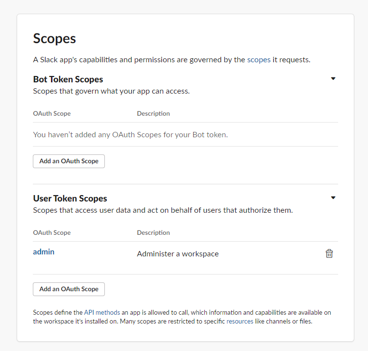
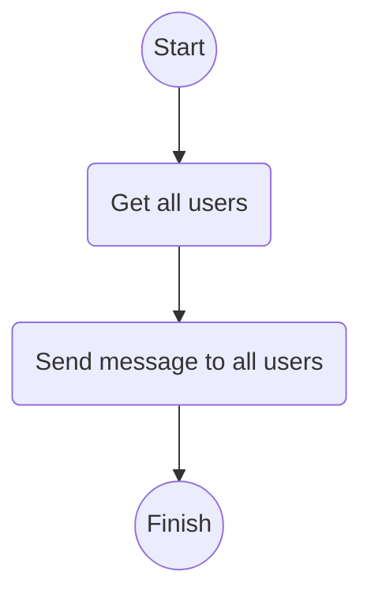

# Slack daily stand up bot

# Setup

Add token scope

Scenarios:

- [ ] Admin User can create a standup
- [ ] On fixed time, automate create a standup

```mermaid
graph TD
_start((Start))-->get_all_users(Get all users)
-->send_message_to_all_users(Send message to all users) 
--> finish((Finish))
```

